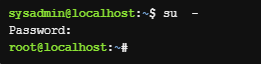

# Linux 
* As habilidades do Linux são necessárias para muitas faixas profissionais de TI. Por exemplo, o conhecimento de comandos básicos do Linux é um pré-requisito para programas de certificação de TI

## Comandos
Os comandos são sensitive case, ou seja, há distinção entre letras maiúsculas e minúsculas.

A maioria dos comandos segue um padrão simples de sintaxe:

` comando [opcoes…] [argumentos…] `

Em outras palavras, você digita um comando, seguido de quaisquer opções e/ou argumentos antes de pressionar a tecla Enter. Normalmente, as opções alteram o comportamento do comando e os argumentos são itens ou valores para o comando agir.

* O comando ` pwd ` pode ser usado para mostras sua localização atual dentro de um sistema de arquivos.
* O comando ` ls ` é usado para listar o conteúdo de um diretório.
* O comado ` cd ` é usado para navegar e alterar entre diretórios.
* O comando ` su ` permite que você atue temporariamente como um usuário administrador.
* O comando ` sudo ` permite que você execute um comando como usuário administrador sem criar um novo shell.
* O comando ` chmod ` é usado para alterar as permissões de um arquivo ou diretório.
* O comando ` chown ` é usado para alterar a propriedade de arquivos e diretórios.
* O comando ` cat ` exibirá todo o conteúdo de um arquivo.
* O comando ` head ` filtra as linhas de saída e visualização da parte superior de um arquivo.
* O comando ` tail ` filtra as linhas de saída e visualização da parte inferior de um arquivo.
* O comando ` cp ` é usado para copiar arquivos.
* O comando ` dd ` é um utilitário para copiar arquivos ou partições inteiras no nível de bits.

## Argumentos
Um argumento pode ser usado para especificar algo para o comando agir. O comando ` ls ` pode ser dado o nome de um diretório como um argumento, e ele irá listar o conteúdo desse diretório.

Como o Linux é de código aberto, existem alguns segredos interessantes que foram adicionados pelos desenvolvedores, pesquise-os para saber mais!

## Opções
As opções podem ser usadas para alterar o comportamento de um comando. O comando ` ls ` foi usado para listar o conteúdo de um diretório e a opção ` -l ` resulta em uma saída de "exibição longa", ou seja, fornece mais irformações sobre cada um dos arquivos listados.

Muitas vezes, o caractere é escolhido para ser mnemônico para o seu propósito, como escolher a letra "l" para longo ou "r" para reverso. Por padrão o comando ` ls ` imprime os resultados em ordem alfabética, se adicionarmos a opção ` -r ` irá imprimir os resultados em ordem alfabética inversa.

As opções podem ser usadas de uma só vez, por exemplo ` ls -l -r ` ou ` ls -rl ` ou ` ls -lr `. Todas as opções vão gerar o mesmo resultado.

## Diretórios
Os diretórios são um tipo de arquivo usado para armazenar outros arquivos, eles fornecem uma estrutura organizacional hierárquica.

Use o comando ` cd ` para navegar e alterar entre diretórios.

` cd [opcoes…] [argumentos…] `

Os diretórios são equivalentes a pastas no Windows e Mac OS. Assim como esses sistemas operacionais mais populares, uma estrutura de diretórios Linux tem um nível superior. Não é chamado de “Meu Computador”, mas sim o diretório root (raiz) e é representado pelo caractere "/". Para mover para o diretório root, use o caractere "/" como argumento para o comando ` cd `.

O argumento para o comando ` cd ` é mais do que apenas o nome de um diretório, na verdade é um caminho. Um caminho é uma lista de diretórios separados pelo caractere "/".

---
Se você pensar no sistema de arquivos como um mapa, os caminhos são as direções passo a passo; eles podem ser usados para indicar a localização de qualquer arquivo dentro do sistema de arquivos. Existem dois tipos de caminhos: absoluto e relativo. Os caminhos absolutos começam na root do sistema de arquivos, os caminhos relativos começam a partir da sua localização atual.

* Caminho absoluto: Um caminho absoluto permite que você especifique a localização exata de um diretório.
* Caminho relativo: um caminho relativo fornece direções para um arquivo relativo à sua localização atual no sistema de arquivos. Os caminhos relativos não começam com o caractere "/", eles começam com o nome de um diretório.
---

### Atalhos
* Os caracteres "..": Independentemente do diretório em que você esteja, os caracteres ".." sempre representa um diretório maior em relação ao diretório atual, às vezes referido como o diretório pai. Mais resumidamente, os caracteres ".." são usados para voltar um diretório.
* O caractere ".": Independentemente do diretório em que você esteja, o caractere . sempre representa seu diretório atual. Para o ` cd ` este atalho não é muito útil, mas será útil para comandos cobertos nas seções subsequentes.
* O caractere "~": Usado para retornar ao seu diretório home a qualquer momento, execute o seguinte comando: ` cd ~ `.

## Acesso Administrativo
Existem muitos comandos Linux que lidam com informações confidenciais, como senhas, hardware do sistema, ou de outra forma operam sob outras circunstâncias excepcionais. Impedir que usuários regulares executem esses comandos ajuda a proteger o sistema. Fazer login como usuário root fornece acesso administrativo, permitindo a execução de alguns dos comandos privilegiados.

## O comando ` su `

` su [opções] [nome-do-usuário] `

O comando ` su ` permite que você atue temporariamente como um usuário administrador. Ele faz isso criando um novo console de entrada de texto que permite digitar comandos, chamado shell. Para sair e retornar à conta, use o comando ` exit `.

Depois de executar o comando, uma senha é necessária. Você consegue mudar ou definir a senha de algum usuário escrevendo o comando ` password [nome-do-usuário] `.

## O comando ` sudo `

` sudo [opções] [comando] `

O comando ` sudo ` permite que você execute um comando como usuário administrador sem criar um novo shell. O comando ` sudo ` também pode ser usado para alternar para outras contas de usuário. Para especificar uma conta de usuário diferente, use a opção ` -u `.

Assim como o comando ` su `, o ` sudo ` também pede senha para entrar no usuário.

Execute o comando ` sl ` como usuário root colocando ` sudo ` na frente dele.

## Permissões 
As permissões determinam as maneiras pelas quais diferentes usuários podem interagir com um arquivo ou diretório.

Vamos usar as informações de um arquivo exemplo para mostrar as informações necessárias:

    -rw-r--r-- 1 sysadmin sysadmin 647 Dec 20  2017 hello.sh

### Tipos de permissão
Existem três permissões diferentes que podem ser colocadas em um arquivo ou diretório: ler, gravar e executar. A maneira pela qual essas permissões se aplicam difere para arquivos e diretórios.

### Alterando Permissões
O comando ` chmod ` é usado para alterar as permissões de um arquivo ou diretório. Somente o usuário administrador (root) ou o usuário que possui o arquivo é capaz de alterar as permissões de um arquivo. Existem duas técnicas para alterar as permissões: Simbólico e Octal. O método simbólico é bom para alterar um conjunto de permissões de cada vez. O método octal ou numérico requer o conhecimento do valor octal de cada uma das permissões e requer que todos os três conjuntos de permissões (usuário, grupo, outros) sejam especificados a cada vez.

Por uma questão de simplicidade, apenas o método simbólico será coberto.
    
    chmod [<conjunto><ação><permissões>]... arquivo
    
Para usar o método simbólico de ` chmod ` você deve, primeiro, indicar qual conjunto de permissões está sendo alterado:

Depois, especifique um símbolo de ação:

Após um símbolo de ação, especifique uma ou mais permissões a serem executadas:

Finalmente, um espaço e os nomes de caminho para os aquivos atribuírem essas permissões. Por exemplo:

    chmod u+x hello.sh

## Alterando a Propriedade
Inicialmente, o proprietário de um arquivo é o usuário que o cria. O comando ` chown ` é usado para alterar a propriedade de arquivos e diretórios. Alterar o proprietário do usuário requer acesso administrativo. Um usuário regular não pode usar esse comando para alterar o proprietário do usuário de um arquivo, mesmo para dar a propriedade de um de seus próprios arquivos a outro usuário. No entanto, o comando ` chown ` também permite alterar a propriedade do grupo, o que pode ser feito pela root ou o proprietário do arquivo.

Para alterar o propietário do usuário de um arquivo use a seguinte sintaxe:

    chown [opções] [proprietário] arquivo

O primeiro argumento, "proprietário", especifica qual usuário deve ser o novo proprietário. O segundo argumento, "arquivo", especifica qual arquivo está mudando a propriedade.

Não se esqueça de usar o comando ` sudo ` para obter os privilégios de administrador, se não você não conseguirá alterar a propriedade de um arquivo ou diretório.

## Exibindo Arquivos
Existem alguns comandos Linux disponíveis para visualizar o conteúdo dos arquivos. O comando ` cat `, que significa "concatenate", é frequentemente usado para visualizar rapidamente o conteúdo de pequenos arquivos.

O comando cat exibirá todo o conteúdo do arquivo, por isso é recomendado principalmente para arquivos menores onde a saída é limitada e não requer rolagem.

    cat [opções] [arquivo]

Ao visualizar arquivos maiores, o comando ` cat ` pode resultar em uma saída muito longa que não pode ser pausada para rolar. Um melhor método de visualização de arquivos de texto longos é com um comando de pager. Alguns exemplos são: ` more ` ou ` less `.

Outra maneira de visualizar o conteúdo dos arquivos é usando os comandos ` head ` e ` tail `. Esses comandos são usados para exibir um número selecionado de linhas na parte superior ou inferior de um arquivo.

    head [opções] [arquivo]
    tail [opções] [arquivo]

A opção ` -n ` com os comandos ` head ` e ` tail ` pode ser usada para especificar a quantidade de linhas a serem exibidas. Para usar a opção ` -n `, especifique a quantidade de linhas do arquivo que deseja exibir após a opção e use o nome do arquivo como argumento.

    head -n [número de linhas] [nome do arquivo]

## Copiando Arquivos
O comando ` cp ` é usado para copiar arquivos. Ele requer pelo menos dois argumentos: uma origem e um destino.

    cp [opções] fonte destino

As permissões podem ter um impacto nos comandos de gerenciamento de arquivos, como o comando ` cp `. Para copiar um arquivo, é necessário ter permissão de execução para acessar o diretório onde o arquivo está localizado e a permissão de leitura para o arquivo que está sendo copiado. Também é necessário ter permissão de gravação e execução no diretório para o qual o arquivo está sendo copiado.

Criar cópias de arquivos pode ser útil por vários motivos:
* Se uma cópia de um arquivo for criada antes que as alterações sejam feitas, é possível voltar ao original.
* Uma cópia de um arquivo pode ser usada para transferir um arquivo para dispositivos de mídia removíveis.
* Uma cópia de um documento existente pode ser usada como modelo para um novo documento.
---
O comando ` dd ` é um utilitário para copiar arquivos ou partições inteiras no nível de bits.

    dd [opções] operando

Este comando tem vários recursos úteis, inclusive:
* Pode ser usado para clonar ou excluir (limpar) discos ou partições inteiros.
* Pode ser usado para copiar dados brutos para dispositivos removíveis, como unidades USB e CDROMs.
* Pode fazer backup e restaurar o MBR (Master Boot Record).
* Pode ser usado para criar um arquivo de tamanho específico preenchido com zeros binários, que pode ser usado como um arquivo de swap (memória virtual).

O comando ` dd ` usa argumentos especiais para especificar como ele funcionará. A seguir ilustra alguns dos argumentos mais comumente usados:

